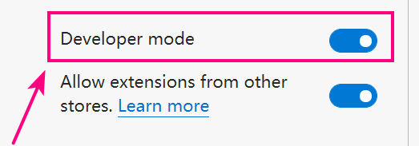
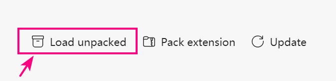
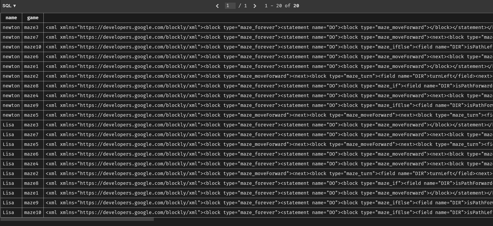

# UCAS Blockly Games Assistant 国科大积木编程助手

## 1. 软件框架

### 1.1 客户端

需安装 Node.js. 在 RehHat 8.4 x86-64 系统上，以 `sudo` 用户组内的普通用户身份执行以下代码：

``` zsh
sudo yum update
sudo yum install nodejs
sudo yum install npm
```

或者： 在 Ubuntu 20.04 x86-64 系统上，以 `sudo` 用户组内的普通用户身份执行以下代码：

``` zsh
sudo apt update
sudo apt install nodejs
sudo apt install npm
```

之后，课通过以下命令配置 node.js 的运行环境：

``` zsh
cd server
npm install
```

会根据package.json 中的依赖自动安装所有模块

最后，通过运行以下命令即可开启 server 端服务进程：

``` zsh
node websocket.js
npm run start   # 和上一条语句同一个作用
npm run test    # 运行所有测试
```

### 1.2 客户端

在 Windows 10、macOS、Linux 等具有图形化桌面的系统上安装基于 Chromium 内核的浏览器，如 Chrome、Chromium、Microsoft Edge 等。

下面以 Microsoft Edge (Chromium based) 英文版为例进行展示。

打开 Edge 浏览器的 Extension 界面：


之后打开该界面内的调试模式：



最后点击 Load unpacked 按钮，上传 `client` 文件夹。



目前只实现了核心的函数，所以只允许在 Chrome 系浏览器的 Console 里直接调用函数以使用功能。

## 2. 使用方法

### 2.1 初阶使用

首先启动服务端程序：

``` zsh
node websocket.js
```

然后按照安装指南，在 Chrome 系浏览器里安装插件。之后打开 www.blockly.games 网站，并打开 Console 控制台。

1. 控制台里输入命令 `register('Lisa', '12345678')`，即可注册 Lisa 用户，注册成功自动登录，注册失败也会有说明。
2. 控制台里输入 `login('Lisa', 'xxx')`，系统提示当前用户 Lisa 已登录。
3. 控制台里输入 `login('newton', '7789')`，系统提示当前用户切换为 newton. 不过 newton 和 Lisa 会共享当前的 LocalStorage.
4. 控制台里输入 `download_game_data()`，浏览器自动请求当前用户的云端数据，并于本地数据合并。如果云端存档与本地通关方案不同，本地会被覆盖。
5. 控制台里输入 `upload_game_data()`，浏览器自动上传本地数据到云端，与拉取云端数据相反，如果本地与云端不一致，本地数据会被保存，云端不会被覆盖。



### 2.2 后续使用

使用 WebUI，方便普通用户使用。

## 3. 开发者教程

Server 开发需要熟悉 Node.JS 的异步编程逻辑，同时掌握 sqlite3 等数据库的使用。

Client 端需要掌握基本的 JavaScript ES6 编程技能。

## 4. 联系我们

主要开发者：

- 刘鹏，email: liupeng19[at]mails.ucas.edu.cn
- 晏悦，email: yanyue171[at]mails.ucas.ac.cn
