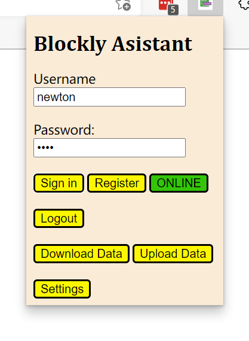

# UCAS Blockly Games Assistant 国科大积木编程助手

## 1. 软件框架

### 1.1 客户端

需安装 Node.js. 在 RehHat 8.4 x86-64 系统上，以 `sudo` 用户组内的普通用户身份执行以下代码：

``` zsh
sudo yum update
sudo yum install nodejs
sudo yum install npm
```

或者： 在 Ubuntu 20.04 x86-64 系统上，以 `sudo` 用户组内的普通用户身份执行以下代码：

``` zsh
sudo apt update
sudo apt install nodejs
sudo apt install npm
```

之后，课通过以下命令配置 node.js 的运行环境：

``` zsh
cd server
npm install
```

会根据package.json 中的依赖自动安装所有模块

最后，通过运行以下命令即可开启 server 端服务进程：

``` zsh
cd server    # 注意，必须在 server 目录里执行，因为数据库引用是相对引用
node websocket.js
```

如果你想在公网服务器上部署服务端代码，只需要在 `client/js/background.js` 里所有的 `localhost` 字符更改为你的 IP 或 域名即可，同时注意在你服务器的防火墙里打开 `9999` 端口的 `INPUT` 权限。

测试：

```
npm run start   # 和上一条语句同一个作用
npm run test    # 运行所有测试
```

### 1.2 客户端

在 Windows 10、macOS、Linux 等具有图形化桌面的系统上安装基于 Chromium 内核的浏览器，如 Chrome、Chromium、Microsoft Edge 等。

下面以 Microsoft Edge (Chromium based) 英文版为例进行展示。

打开 Edge 浏览器的 Extension 界面：


之后打开该界面内的调试模式：


最后点击 Load unpacked 按钮，上传 `client` 文件夹。




> NOTE: 目前插件的 UI 还不好看，且只允许在 Chrome 系浏览器的 Console 里使用该插件，亲测 FireFox 不可用。

支持的平台：

- Microsoft Edge (Chromium)
- Google Chrome

## 2. 使用方法

### 2.1 使用说明

首先启动服务端程序：

``` zsh
cd server
node websocket.js
```

然后按照安装指南，在 Chrome 系浏览器里安装插件。按照插件的 UI 提示操作即可。

> NOTE: 唯一值得注意的是，在操作积木编程助手插件的小窗口进行上传、下载时，务必保证当前浏览器界是 blockly.games 网站。


### 2.2 后续使用

后续会使用 CSS 优化 WebUI，方便普通用户使用。

## 3. 开发者教程

Server 开发需要熟悉 Node.JS 的异步编程逻辑，同时掌握 sqlite3 等数据库的使用。

Client 端需要掌握基本的 JavaScript ES6 编程技能。

## 4. 联系我们

主要开发者：

- 刘鹏，email: liupeng19[at]mails.ucas.edu.cn
- 晏悦，email: yanyue171[at]mails.ucas.ac.cn
