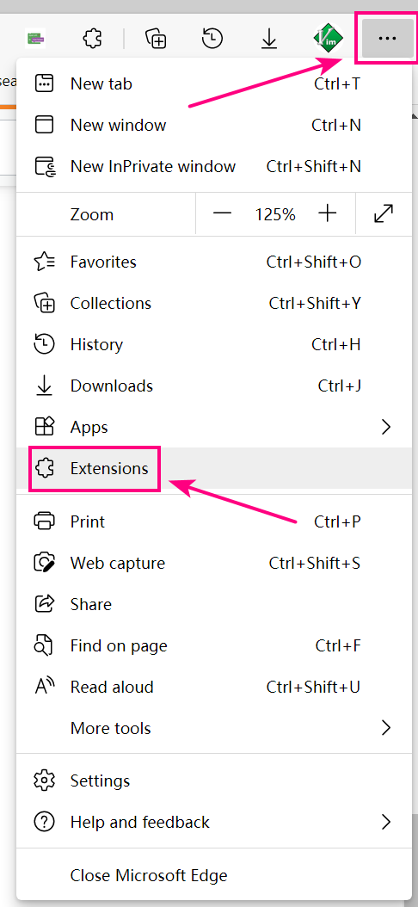

# UCAS Blockly Games Assistant 国科大积木编程助手

## 1. 软件框架

### 1.1 客户端

需安装 Node.js. 在 RehHat 8.4 x86-64 系统上，以 `sudo` 用户组内的普通用户身份执行以下代码：

``` zsh
sudo yum update
sudo yum install nodejs
sudo yum install npm
```

之后，课通过以下命令配置 node.js 的运行环境：

``` zsh
cd server
npm install fs
npm install express
npm install sqlite3
```

最后，通过运行以下命令即可开启 server 端服务进程：

``` zsh
node websocket.js
```

### 1.2 客户端

在 Windows 10、macOS、Linux 等具有图形化桌面的系统上安装基于 Chromium 内核的浏览器，如 Chrome、Chromium、Microsoft Edge 等。

下面以 Microsoft Edge (Chromium based) 英文版为例进行展示。

打开 Edge 浏览器的 Extension 界面：



之后打开该界面内的调试模式：


最后点击 Load unpacked 按钮，上传 `client` 文件夹。


## 2. 使用方法

### 2.1 初阶使用

目前只实现了核心的函数，所以只允许在 Chrome 系浏览器的控制台里直接调用函数以使用功能。

### 2.2 后续使用

后续将继续添加 WebUI，方便普通用户使用。

## 3. 开发者教程

Server 开发需要熟悉 Node.JS 的异步编程逻辑，同时掌握 sqlite3 等数据库的使用。

Client 端需要掌握基本的 JavaScript ES6 编程技能。

## 4. 联系我们

主要开发者：刘鹏，email: liupeng19[at]mails.ucas.edu.cn
